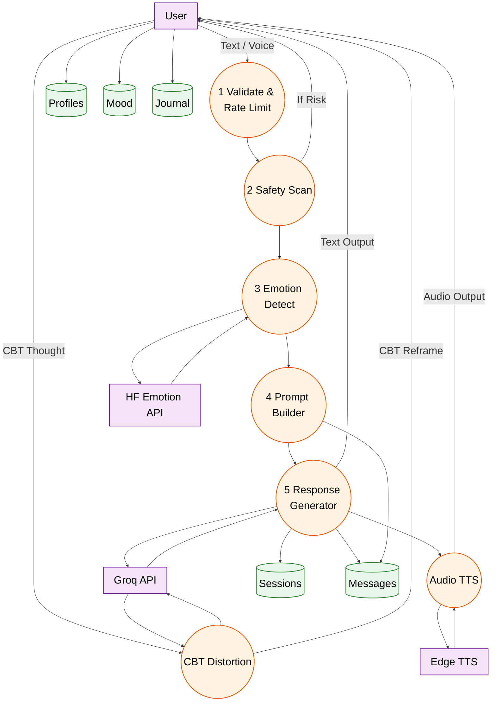
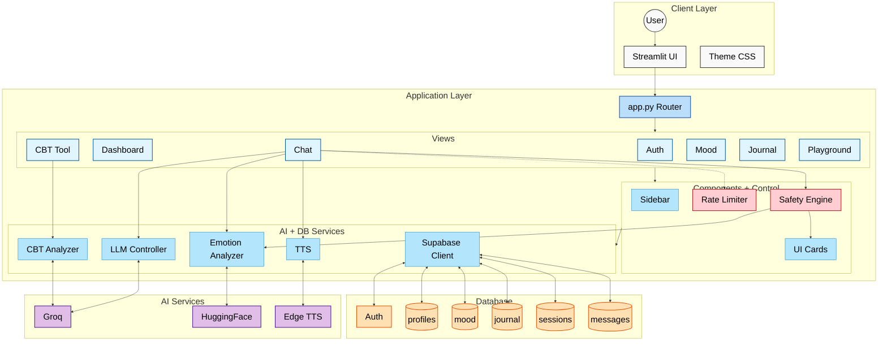
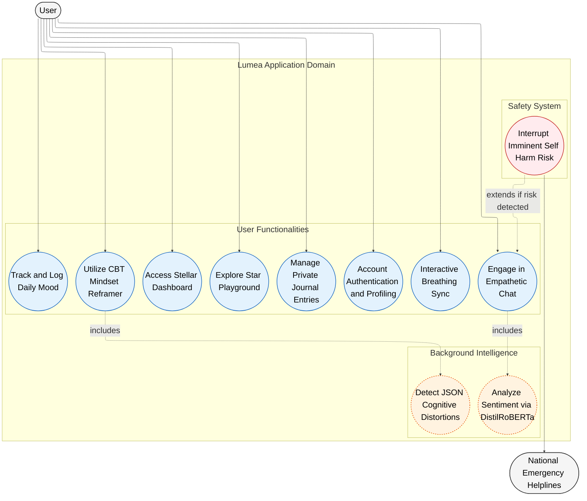
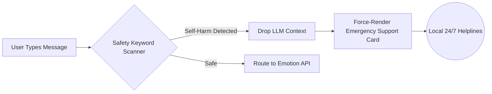
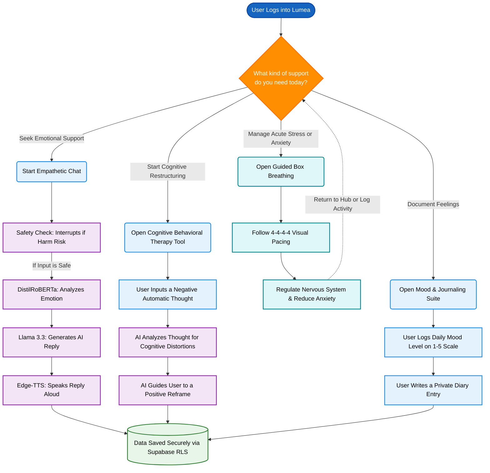
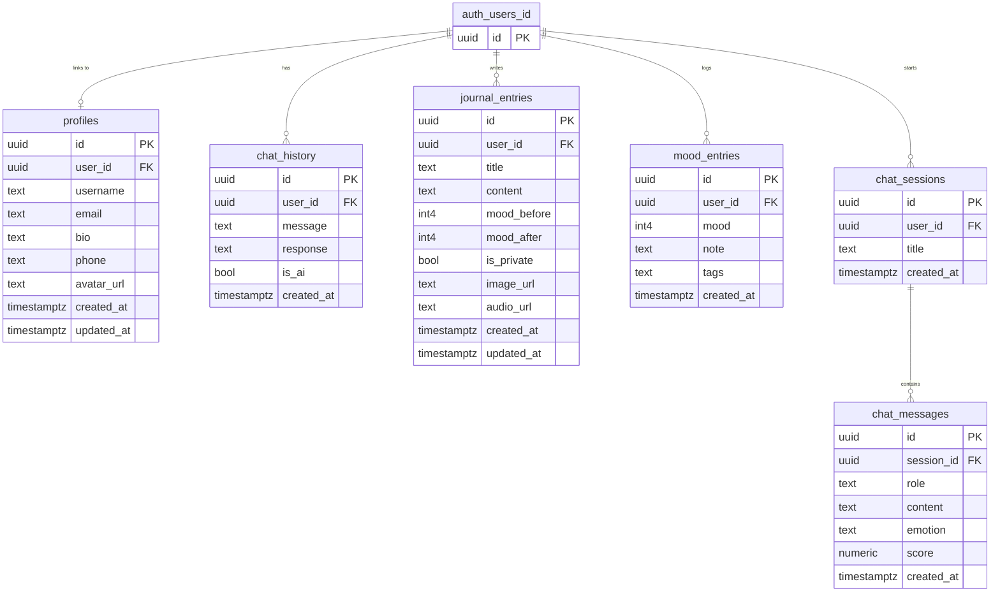

# Lumea - System Architecture & Diagrams 📐

This document provides a highly detailed visual and structural overview of the **Lumea - Celestial Sanctuary**, integrating the latest schemas mapping user flows, safety, layouts, and data.

---

## 🔄 1. Data Flow Diagram
Tracks the complex flow of information from user input through processing, safety engines, and AI generations.

---

## 🏛️ 2. Layered Architecture
Highlights the modular decomposition of the architecture from the interface down to persistent storage.

---

## 👥 3. System Use Case Diagram
Maps out exactly what the user can do within the sanctuary, linking front-end functions to backend intelligence.

---

## 🛡️ 4. Safety Protocol
Demonstrates the secure safety interception layer that preemptively blocks harm risks before context reaches the LLM.

---

## 🚀 4. System Overview
Provides a generalized top-level map of the major user interaction pathways and AI intelligence branches.

---

## 🗄️ 5. Entity Relationship Schema (ERD)
The robust backend schema managing the expanded structure of `auth_users_id`, `profiles`, `chat_history`, `mood_entries`, and `journal_entries`.

